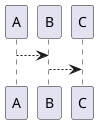
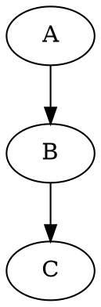

# 开源图表格式对比指南

> 本指南比较各种在GitHub网页中查看代码形式的流程图格式

## 📊 各类开源画图格式对比

### 1. Mermaid 格式（⭐ 推荐首选）

#### 概述
```
GitHub原生支持，无需任何插件或转换！
```

| 特性 | 评分 | 说明 |
|------|------|------|
| GitHub支持 | ⭐⭐⭐⭐⭐ | 原生支持，自动渲染 |
| 学习曲线 | ⭐⭐⭐⭐ | 语法简单易学 |
| 功能完整性 | ⭐⭐⭐⭐ | 支持大多数常见图表 |
| 美观度 | ⭐⭐⭐⭐ | 现代风格，可自定义 |
| 导出选项 | ⭐⭐⭐⭐⭐ | 支持PNG/SVG/PDF/URL |
| 实时编辑 | ⭐⭐⭐⭐⭐ | 在线编辑器支持很好 |

#### 支持的图表类型
- ✅ 流程图 (flowchart/graph)
- ✅ 时序图 (sequenceDiagram)
- ✅ 类图 (classDiagram)
- ✅ 状态图 (stateDiagram)
- ✅ 甘特图 (gantt)
- ✅ 饼图 (pie)
- ✅ 象限图 (quadrantChart)

#### 代码示例


#### 优点
```
✅ GitHub网页直接渲染，无需任何额外操作
✅ 代码简洁，易于维护
✅ 支持暗色/亮色主题
✅ 响应式，适配各种屏幕
✅ 可导出为多种格式
✅ 有很好的在线编辑器
```

#### 缺点
```
❌ 不能用于GitHub离线
❌ 某些复杂图表可能不够灵活
❌ 渲染速度可能受网络影响
```

#### 文件位置
```
📄 QWEN_FLOW_MERMAID.md
```

---

### 2. PlantUML 格式

#### 概述
```
功能最强大，支持最多图表类型
但GitHub不原生支持，需要转换
```

| 特性 | 评分 | 说明 |
|------|------|------|
| GitHub支持 | ⭐ | 不支持，需要转换为图片 |
| 学习曲线 | ⭐⭐⭐ | 语法相对复杂 |
| 功能完整性 | ⭐⭐⭐⭐⭐ | 支持最多图表类型 |
| 美观度 | ⭐⭐⭐⭐⭐ | 专业级渲染 |
| 导出选项 | ⭐⭐⭐⭐⭐ | 支持所有常见格式 |
| 实时编辑 | ⭐⭐⭐⭐ | 在线编辑器功能强大 |

#### 支持的图表类型
- ✅ 时序图 (sequence)
- ✅ 用例图 (usecase)
- ✅ 类图 (class)
- ✅ 活动图 (activity)
- ✅ 组件图 (component)
- ✅ 部署图 (deployment)
- ✅ 状态图 (state)
- ✅ 对象图 (object)
- ✅ 包图 (package)

#### 代码示例


#### 优点
```
✅ 支持最完整的UML图表
✅ 渲染质量最高
✅ 适合复杂架构设计
✅ 专业度最高
✅ VS Code有很好的插件
```

#### 缺点
```
❌ GitHub不原生支持
❌ 需要在线转换或本地转换
❌ 学习曲线较陡
❌ 必须转换为图片才能在GitHub显示
❌ 代码变更时需要重新转换
```

#### 使用方式
```bash
# 方式1：在线编辑器
http://www.plantuml.com/plantuml/uml/

# 方式2：本地转换
plantuml -Tsvg QWEN_FLOW_PLANTUML.md
plantuml -Tpng QWEN_FLOW_PLANTUML.md

# 方式3：VS Code插件
# 安装 "PlantUML" 插件后可直接预览
```

#### 文件位置
```
📄 QWEN_FLOW_PLANTUML.md
```

---

### 3. GraphViz 格式

#### 概述
```
开源图表渲染引擎，功能强大
语法基于DOT语言
```

| 特性 | 评分 | 说明 |
|------|------|------|
| GitHub支持 | ⭐ | 不支持，需要转换 |
| 学习曲线 | ⭐⭐ | DOT语言需要学习 |
| 功能完整性 | ⭐⭐⭐⭐ | 支持多种图表 |
| 美观度 | ⭐⭐⭐⭐ | 专业外观 |
| 导出选项 | ⭐⭐⭐⭐⭐ | 支持所有格式 |
| 实时编辑 | ⭐⭐⭐ | 有在线编辑器 |

#### 代码示例


#### 优点
```
✅ 自动布局算法优秀
✅ 适合大型图表
✅ 最小化代码行数
✅ 支持多种输出格式
```

#### 缺点
```
❌ GitHub不原生支持
❌ 需要转换为图片
❌ 学习曲线陡
❌ 在线工具较少
```

---

### 4. SVG 格式（矢量图）

#### 概述
```
标准矢量图格式，所有浏览器原生支持
可以用代码生成，也可以用设计工具创建
```

| 特性 | 评分 | 说明 |
|------|------|------|
| GitHub支持 | ⭐⭐⭐⭐⭐ | 完全支持，渲染完美 |
| 学习曲线 | ⭐ | 手写SVG很困难 |
| 功能完整性 | ⭐⭐⭐⭐⭐ | 可以做任何图形 |
| 美观度 | ⭐⭐⭐⭐⭐ | 取决于设计水平 |
| 导出选项 | ⭐⭐⭐⭐⭐ | 可转换为任何格式 |
| 实时编辑 | ⭐⭐⭐ | 需要特殊编辑器 |

#### 代码示例
```svg
<svg width="100" height="100">
    <circle cx="50" cy="50" r="40" stroke="black" stroke-width="3" fill="red" />
</svg>
```

#### 优点
```
✅ GitHub原生支持
✅ 质量最高，矢量渐进式渲染
✅ 可交互，可动画
✅ 文件大小可控
✅ 可在GitHub中内嵌
```

#### 缺点
```
❌ 手写SVG非常困难
❌ 需要图形设计工具
❌ 生成的代码很复杂
❌ 版本控制不方便（二进制格式）
❌ 修改需要编辑工具
```

#### 生成方式
```
1. 使用在线工具（draw.io, Lucidchart等）
2. 使用Mermaid导出SVG
3. 使用PlantUML导出SVG
4. 使用Inkscape等设计工具
```

---

### 5. Markdown 表格 + ASCII 艺术

#### 概述
```
完全基于文本，最简单但表现力最有限
```

| 特性 | 评分 | 说明 |
|------|------|------|
| GitHub支持 | ⭐⭐⭐⭐⭐ | 完全支持 |
| 学习曲线 | ⭐⭐⭐⭐⭐ | 非常简单 |
| 功能完整性 | ⭐ | 功能非常有限 |
| 美观度 | ⭐⭐ | 依赖ASCII艺术 |
| 导出选项 | ⭐⭐ | 只能导出文本 |
| 实时编辑 | ⭐⭐⭐⭐⭐ | 任何编辑器 |

#### 代码示例
```markdown
┌──────┐
│ 开始 │
└───┬──┘
    │
    ▼
┌──────┐
│ 处理 │
└───┬──┘
    │
    ▼
┌──────┐
│ 结束 │
└──────┘
```

#### 优点
```
✅ 完全基于文本，版本控制完美
✅ 任何编辑器都可以编辑
✅ 加载速度最快
✅ 完全离线可用
```

#### 缺点
```
❌ 美观度有限
❌ 复杂图表难以表现
❌ 很难保持一致的格式
❌ 修改维护困难
```

---

## 🎯 选择建议

### 场景 1：想在GitHub网页直接预览 ✅
**→ 使用 Mermaid**

```
优点：打开GitHub网页即可看到渲染后的图表
特性：支持流程图、时序图、类图等常见类型
成本：零成本，GitHub原生支持
```

### 场景 2：需要最高质量的专业图表
**→ 使用 PlantUML**

```
优点：功能最完整，支持所有UML图表
缺点：需要额外转换步骤
方案：转换为SVG，提交到GitHub
```

### 场景 3：需要最大的灵活性和美观度
**→ 使用 SVG**

```
优点：完全自定义，质量最高
缺点：制作困难，需要设计工具
方案：用draw.io或Figma设计，导出SVG
```

### 场景 4：只需要简单的表格和文字说明
**→ 使用 Markdown 表格 + ASCII**

```
优点：最简单，版本控制最好
缺点：功能有限
应用：已在 FLOWCHART_VISUAL.md 中使用
```

---

## 📋 QWen项目中的应用

```
┌─────────────────────────────────────────────────┐
│          QWen 流程图文档对比                    │
├─────────────────────────────────────────────────┤
│                                                 │
│ 📄 QWEN_FLOW_MERMAID.md                        │
│    ✅ GitHub网页直接预览                       │
│    ✅ 10个精美流程图                           │
│    ✅ 推荐首选                                 │
│    📌 查看方式：直接打开GitHub网页             │
│                                                 │
│ 📄 QWEN_FLOW_PLANTUML.md                       │
│    ⚠️  需要在线编辑器或本地转换                │
│    ✅ 8个专业UML图表                           │
│    📌 查看方式：使用PlantUML在线编辑器        │
│    🔗 http://www.plantuml.com/plantuml/uml/   │
│                                                 │
│ 📄 QWEN_AUTH_AND_CALL_FLOW.md                  │
│    ✅ 详细文字说明 + ASCII流程图               │
│    ✅ 系统的知识讲解                           │
│    📌 最全面的参考文档                         │
│                                                 │
│ 📄 FLOWCHART_VISUAL.md                         │
│    ✅ ASCII艺术 + Markdown表格                 │
│    ✅ 最易理解的简化版本                       │
│    📌 快速参考指南                             │
│                                                 │
└─────────────────────────────────────────────────┘
```

---

## 🌐 在线工具清单

### Mermaid
- 官方编辑器：https://mermaid.live
- 在线预览：输入代码自动渲染

### PlantUML
- 官方编辑器：http://www.plantuml.com/plantuml/uml/
- 支持代码导入导出

### GraphViz
- 在线工具：http://www.webgraphviz.com/
- 支持实时预览

### Draw.io
- 官方网站：https://app.diagrams.net/
- 支持导出多种格式（包括SVG和PlantUML）

### Lucidchart
- 官方网站：https://www.lucidchart.com/
- 专业级设计工具

---

## 💡 最佳实践建议

### ✅ Do（推荐做法）
```
1. 使用Mermaid作为主要格式
   └─ 理由：GitHub原生支持，最方便

2. 在.md文件中直接嵌入Mermaid代码块
   └─ GitHub自动渲染

3. 如需更复杂图表，导出Mermaid为SVG
   └─ 保证高质量

4. 为每种图表提供文字说明
   └─ 方便理解

5. 定期更新图表和代码保持同步
   └─ 保证准确性
```

### ❌ Don't（不推荐做法）
```
1. 不要手写复杂的ASCII艺术
   └─ 维护困难，容易出错

2. 不要使用图片格式的流程图
   └─ 无法版本控制，难以修改

3. 不要在GitHub中使用PlantUML而不转换
   └─ 无法显示，用户体验差

4. 不要混用多种格式
   └─ 项目混乱不一致
```

---

## 📊 格式对比总结表

| 格式 | GitHub支持 | 学习难度 | 功能完整 | 美观度 | 推荐度 |
|------|-----------|---------|--------|--------|--------|
| **Mermaid** | ✅ 完全 | 🌟🌟🌟🌟 | 🌟🌟🌟🌟 | 🌟🌟🌟🌟 | ⭐⭐⭐⭐⭐ |
| **PlantUML** | ⚠️ 需转换 | 🌟🌟🌟 | 🌟🌟🌟🌟🌟 | 🌟🌟🌟🌟🌟 | ⭐⭐⭐⭐ |
| **GraphViz** | ⚠️ 需转换 | 🌟🌟 | 🌟🌟🌟🌟 | 🌟🌟🌟🌟 | ⭐⭐⭐ |
| **SVG** | ✅ 完全 | 🌟 | 🌟🌟🌟🌟🌟 | 🌟🌟🌟🌟🌟 | ⭐⭐⭐ |
| **Markdown+ASCII** | ✅ 完全 | 🌟🌟🌟🌟🌟 | 🌟 | 🌟🌟 | ⭐⭐ |

---

## 🎓 学习资源

### Mermaid
- 官方文档：https://mermaid.js.org/
- 中文教程：GitHub上有很多优质教程

### PlantUML
- 官方文档：https://plantuml.com/
- 中文文档：https://plantuml.com/zh/

### SVG
- MDN文档：https://developer.mozilla.org/en-US/docs/Web/SVG
- W3C规范：https://www.w3.org/TR/SVG2/

---

## 🚀 快速开始

### 使用Mermaid（推荐）
```markdown
1. 打开文件：QWEN_FLOW_MERMAID.md
2. 在GitHub网页上打开
3. 图表自动渲染，无需任何操作
4. 可点击右上角导出为图片
```

### 使用PlantUML
```
1. 打开文件：QWEN_FLOW_PLANTUML.md
2. 访问：http://www.plantuml.com/plantuml/uml/
3. 复制代码块到编辑器
4. 自动生成图表
5. 导出为SVG/PNG添加回GitHub
```

---

## 总结

| 需求 | 推荐方案 |
|------|---------|
| 想直接在GitHub查看 | → Mermaid |
| 需要最强大的功能 | → PlantUML |
| 需要专业级美观度 | → SVG |
| 快速原型设计 | → Mermaid |
| 项目文档 | → Mermaid + PlantUML |
| 简单说明 | → Markdown表格 |

**最终建议：使用 Mermaid 作为主要格式，这是GitHub友好且功能完整的最佳平衡点！**

