# QWen API 流程图 - Mermaid 格式（GitHub原生支持）

> ⭐ **GitHub支持直接渲染Mermaid图表！** 在GitHub网页中打开本文件可以直接看到流程图。

## 1. 完整的端到端调用流程

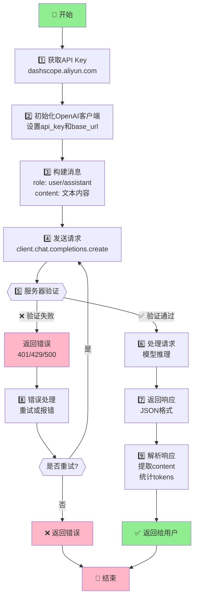

---

## 2. 鉴权流程图

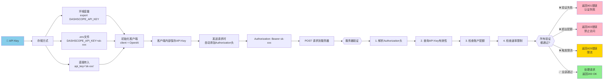

---

## 3. 错误处理决策树

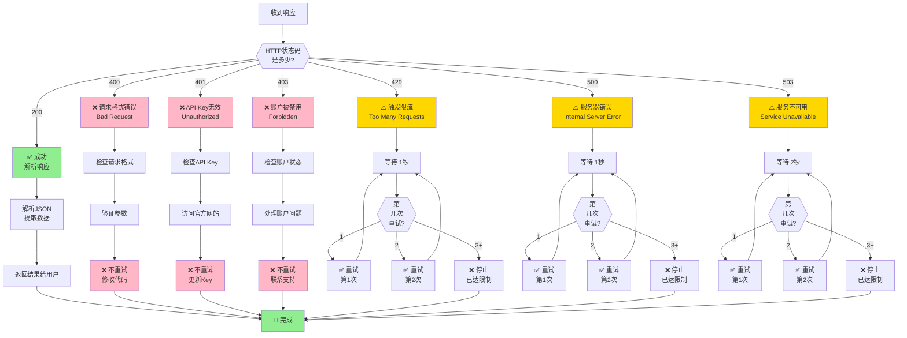

---

## 4. 流式调用 vs 传统调用

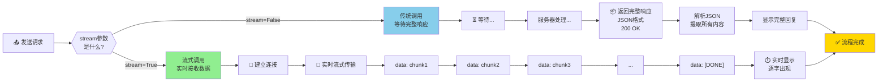

---

## 5. 两种API调用方式对比

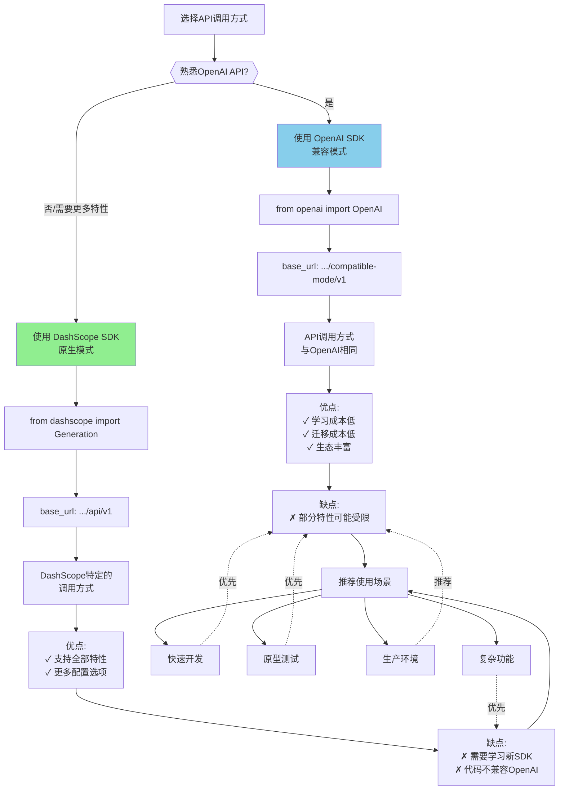

---

## 6. 单个请求的生命周期

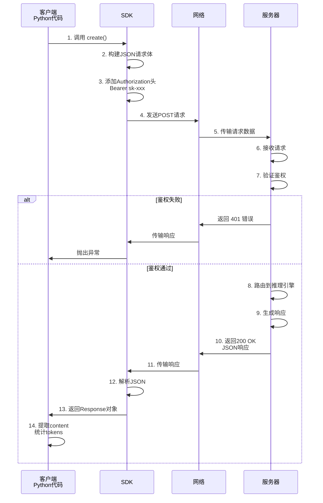

---

## 7. 模型选择决策树

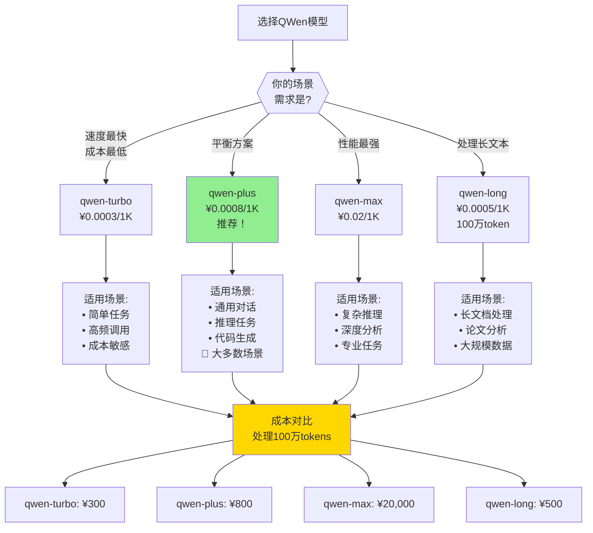

---

## 8. 实际应用场景1：简单问答

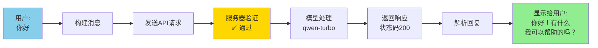

---

## 9. 实际应用场景2：流式对话

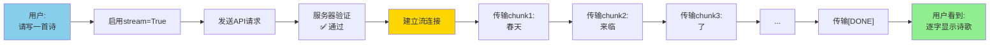

---

## 10. 实际应用场景3：错误处理和重试

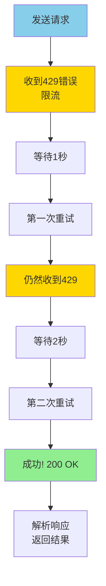

---

## 快速参考表

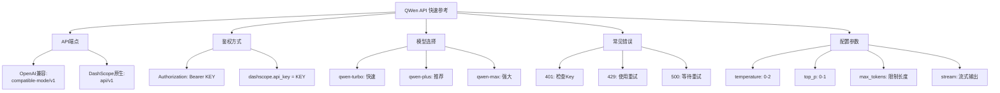

---

## 如何在GitHub网页中查看

✨ **GitHub 原生支持 Mermaid 图表！**

在GitHub网页中查看此文件时，所有Mermaid代码块会被自动渲染成漂亮的流程图。

### 优点：
- ✅ GitHub原生支持，无需插件
- ✅ 代码版本控制
- ✅ 易于编辑和维护
- ✅ 支持导出为图片
- ✅ 响应式设计，适配各种屏幕

### 如何使用：
1. 访问 https://github.com/konyellin-cyber/QwenTest/blob/main/QWEN_FLOW_MERMAID.md
2. GitHub会自动渲染所有流程图
3. 可以滚动、放大、查看细节

### 导出图片：
- 在图表右上角有下载按钮
- 可导出为 PNG, SVG, PDF等格式

---

## 更多Mermaid图表类型

本文档使用了以下Mermaid图表类型：

- 📊 **flowchart (graph)** - 流程图、决策树
- 📈 **sequenceDiagram** - 时序图、交互流程
- 🔄 **stateDiagram** - 状态转移图

所有这些在GitHub网页中都能完美渲染！

