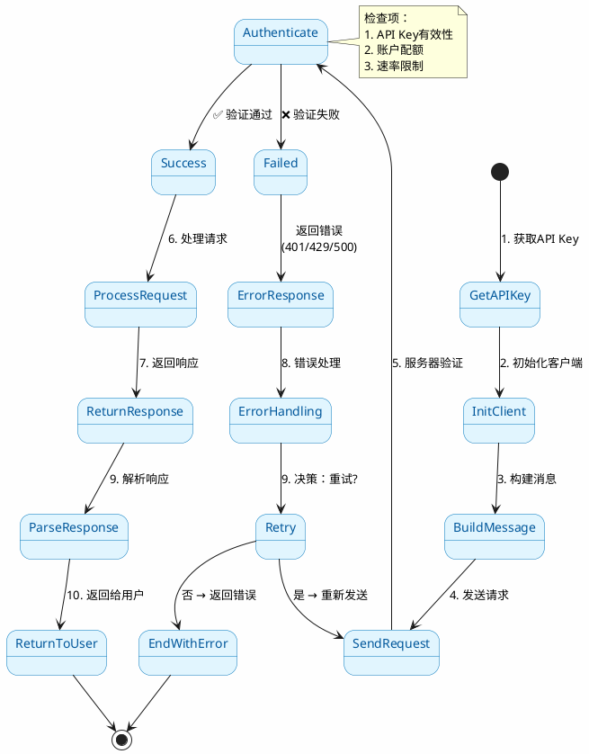
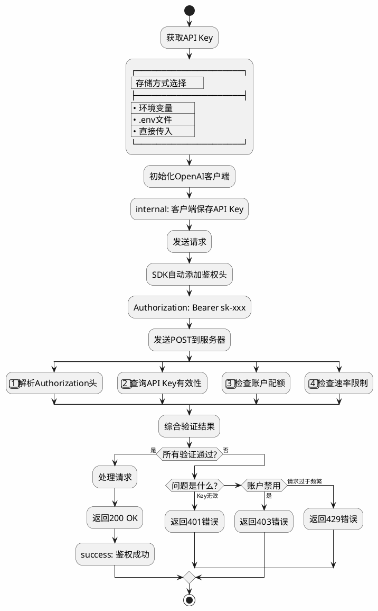
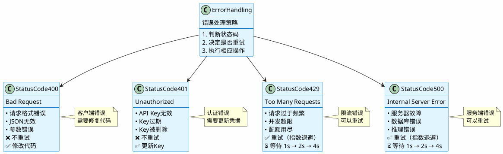
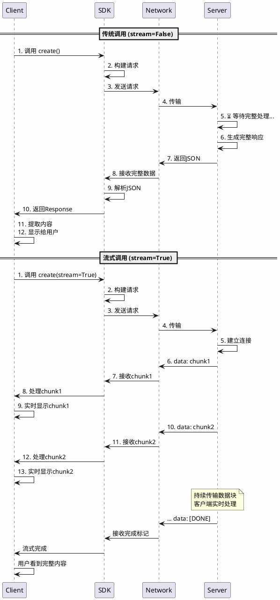
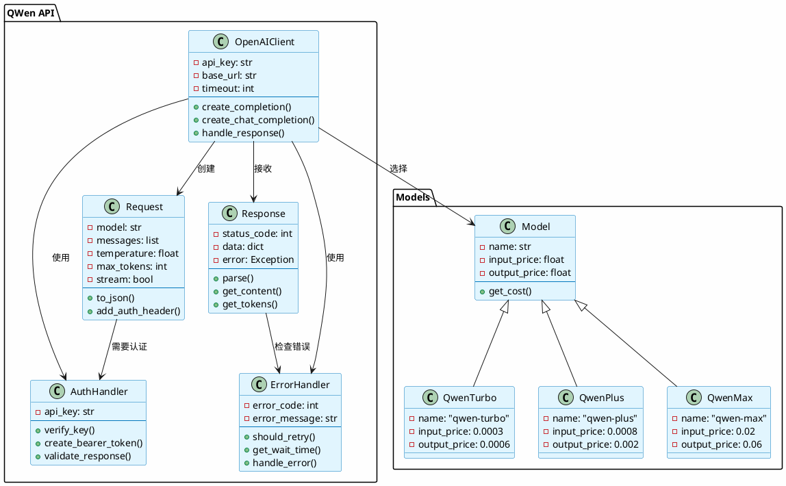
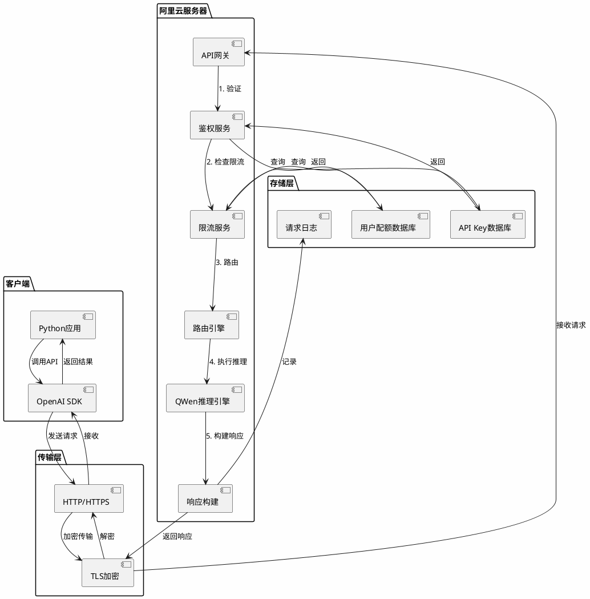

# QWen API 流程图 - PlantUML 格式

> 📌 **PlantUML格式说明**
> 
> PlantUML是一个开源项目，允许用户用简单直观的语言定义图表。
> GitHub不原生支持，但可以通过以下方式查看：
> 1. 使用PlantUML在线编辑器
> 2. 使用VS Code插件
> 3. 转换为SVG或PNG后提交

## 1. 完整调用流程（状态图）



---

## 2. 鉴权流程（活动图）



---

## 3. 错误处理决策树



---

## 4. 时序图：流式vs非流式



---

## 5. 类图：API调用组件



---

## 6. 组件图：系统架构



---

## 7. 对象图：请求示例

```plantuml
@startuml
skinparam backgroundColor #FEFEFE

object Request {
    model = "qwen-plus"
    messages = [
        {role: "user", content: "你好"}
    ]
    temperature = 0.7
    max_tokens = 1024
    stream = false
    timestamp = "2026-01-20T10:00:00Z"
}

object Headers {
    Authorization = "Bearer sk-xxxxxxxxxx"
    Content-Type = "application/json"
    User-Agent = "OpenAI/Python 1.0.0"
    Accept-Encoding = "gzip, deflate"
}

object Response {
    status_code = 200
    status_text = "OK"
    choices = [
        {
            finish_reason: "stop"
            message: {role: "assistant", content: "..."}
        }
    ]
    usage = {
        input_tokens: 10
        output_tokens: 50
        total_tokens: 60
    }
    request_id = "uuid-1234-5678"
}

object TokenUsage {
    input_tokens = 10
    output_tokens = 50
    total_tokens = 60
    cost = 0.0014
}

Request --> Headers: 包含
Response --> TokenUsage: 统计

@enduml
```

---

## 8. 部署图：DashScope架构

```plantuml
@startuml
skinparam backgroundColor #FEFEFE
skinpanel rectangle {
    BackgroundColor #E1F5FE
    BorderColor #0277BD
}

rectangle "用户端" {
    artifact "Python应用" as PyApp
    artifact "OpenAI SDK" as OpenAISDK
    artifact ".env文件\n(API Key)" as Env
}

rectangle "互联网" {
    artifact "HTTPS请求" as HTTPS
}

rectangle "阿里云 DashScope" {
    rectangle "全球地域" {
        node "中国" as CN {
            card "API服务\nqwen-plus\nqwen-max" as CNAPI
        }
        
        node "新加坡" as SG {
            card "API服务\nqwen-plus\nqwen-max" as SGAPI
        }
        
        node "日本" as JP {
            card "API服务\nqwen-plus\nqwen-max" as JPAPI
        }
    }
    
    rectangle "核心服务" {
        card "鉴权\n验证Key" as Auth
        card "限流\n检查配额" as RateLimit
        card "推理引擎\nQWen模型" as Inference
    }
    
    rectangle "存储" {
        database "Key存储" as KeyDB
        database "配额存储" as QuotaDB
        database "日志存储" as LogDB
    }
}

PyApp --> Env: 读取
PyApp --> OpenAISDK: 调用
OpenAISDK --> HTTPS: 加密传输
HTTPS --> CNAPI: 路由

CNAPI --> Auth: 1验证
Auth --> KeyDB: 查询
CNAPI --> RateLimit: 2限流
RateLimit --> QuotaDB: 查询
CNAPI --> Inference: 3推理
Inference --> LogDB: 记录

note right of CNAPI
    选择最近的服务器
    减少延迟
end note

@enduml
```

---

## 在线查看方式

### 方式1：PlantUML在线编辑器
访问 http://www.plantuml.com/plantuml/uml/

1. 复制上面的代码
2. 粘贴到编辑器
3. 自动生成图表
4. 可导出为PNG/SVG/PDF

### 方式2：VS Code插件
1. 安装 "PlantUML" 插件
2. 打开此markdown文件
3. 预览时自动渲染

### 方式3：转换为SVG
```bash
# 需要安装 plantuml
plantuml -Tsvg QWEN_FLOW_PLANTUML.md

# 或使用在线服务
```

---

## PlantUML 的优点

✨ **相比其他格式的优势：**

- ✅ 支持多种图表类型
- ✅ 代码简洁易读
- ✅ 自动布局，无需手工调整
- ✅ 易于版本控制
- ✅ 支持导出多种格式
- ✅ 生态工具丰富

## PlantUML 图表类型

本文档使用了：

- 📊 **stateDiagram** - 状态图
- 📈 **activity** - 活动图
- 🔄 **sequence** - 时序图
- 📦 **class** - 类图
- 🏗️ **component** - 组件图
- 🗂️ **object** - 对象图
- 🌐 **deployment** - 部署图

